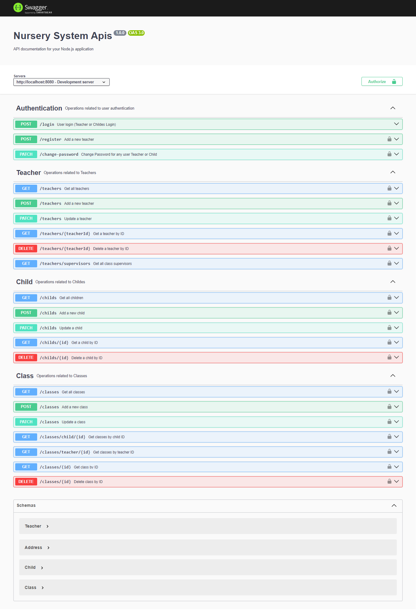

# My Project

Nursery System.
    -You will build part of small Nursery, the system will have only one administrator 
    with static username and password, teachers and children. Teachers should 
    register first, and administrator will add children to the system. Back end will be 
    created as RESTFUL API with json responses with correct status code

## Features

- Authenticatin
    - Login as a admin or teacher or child
    - register as a teacher
    - change password for teacher or child
    - Authorization

- Crud of teachers
- Crud of childerns
- Crud of classes

- encrypt passsword

- upload images

- swagger documentation

## Installation

- npm i 
    - to install packages -- bcrypt, dotenv, express, express-validator, jsonwebtoken, mongoose, multer, swagger-jsdoc, swagger-ui-express--

## Usage

- nodemon app
- then run project on http://localhost:8080 
- and can show swagger documentation on http://localhost:8080/api-docs

## Images

